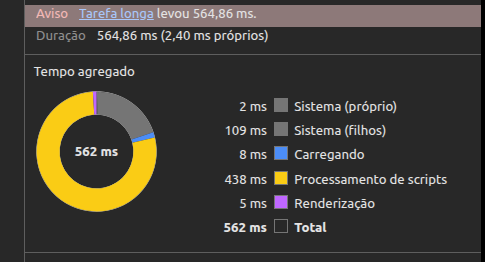

## Tipagem

- A estrutura do contrato do formulário `OSFormData` foi alterada para se adequar ao useFieldArray.A estrutura que, antes era plana, passou a ter array de objeto. Como:

```typescript
parts: {
  partNumber: string;
  quantity: number;
  unitValue: string;
  partDescription: string;
}
[];
```

## Desafios

### BUG no componente evidencesField

#### Tratamento de imagen

No componente `evidencesField.tsx` foram idenficados alguns [[bugs]] na renderização de imagens, sendo um deles relacionado ao race condition.

- Race Condition: A Race Condition (ou condição de corrida) é um bug que ocorre em sistemas de software ou hardware quando múltiplos processos ou threads tentam acessar e modificar o mesmo recurso compartilhado ao mesmo tempo.

Esses foram alguns erros que se manifestaram no mobile durante os testes (desktop não apresentou erro ainda):

- A imagem é selecionada mas o card fica em branco
- múltiplas imagens quebram (mesmo erro anterior) (obs: mutiple desabilitado)
- PIOR DE TODAS: a página recarrega e apaga todo o form (ainda não persisti os dados)

O `label` foi substituido pelo `button + ref` pelo seguinte motivo:

Em browsers móveis (Safari/WebKit especialmente), um `<label> com <input type="file">` dentro, quando está dentro de um <form>`, pode disparar o submit do form em certas condições de toque. O form submita, a página recarrega, tudo some.

**Melhoria para essa feature: mover a lógica de tratamento de imagem para o backend**

#### Análise do debug

O código de conversão de imagens rodando no cliente ocupava toda a thread do JavaScript, o que levava o navegador a reiniciar a tab. Como este problema só ocorria no mobile foi preciso utilizar o **depuração via usb com o remote debug**.
Uma das primeiras constatções de inviabilidade desse processo foi o valor elevado de frames, que chegaram a bater **8.139,1 ms**.
Processo:
upload →
decode imagem →
canvas.drawImage →
canvas.toBlob →
React state →
rerender →
preview

Obs: 564ms numa "tarefa longa" é crítico para mobile. O browser considera qualquer tarefa acima de 50ms como Long Task — ela trava input, scroll, animações. No Android com hardware limitado isso é ainda pior.
